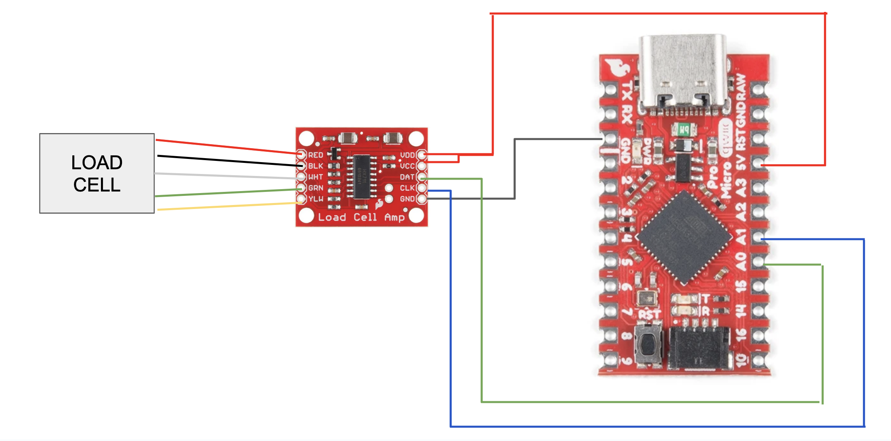
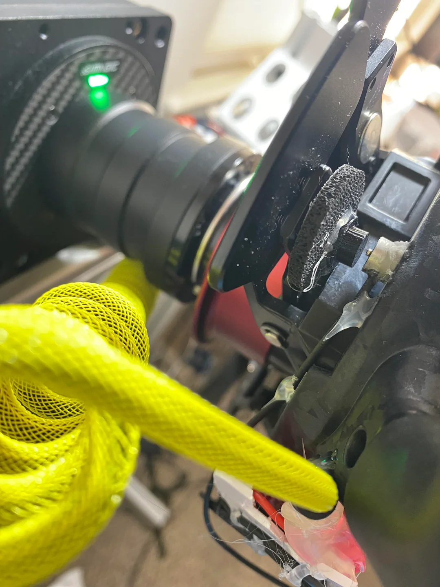

# NOTE: I WILL BE UPDATING THIS WITH AN INA333 MODULE SOON.

The HX711 has 80 SPS, so ~13 ms latency. I will be trying out an analog amp -> pro micro that will allow ~10k SPS.

# Loadcell

How to make your own loadcell using a strain gauge and an Arduino.
## Components
// table
| Component | Quantity | Link |
|-----------|----------|------|
| 30kg Loadcell | 1 | [Link](https://www.aliexpress.us/item/2251832865750712.html) |
| HX711 | 1 | [Link](https://www.sparkfun.com/sparkfun-load-cell-amplifier-hx711.html) |
| Pro Micro | 1 | [Link](https://www.sparkfun.com/sparkfun-qwiic-pro-micro-usb-c-atmega32u4.html) |
| 22 AWG Wire | 5 in |  |
| Foam Rubber | 1 | [Link](https://www.amazon.com/dp/B0D9S9JVCR?th=1) |
| 3m command strip | 1 | [Link](https://www.amazon.com/Command-Medium-Adhesive-Hanging-Removable/) |
| 3dp 100% infill polycarb Load cell piston | 1 | [Link](loadcell_cap.stl) |
| 3dp Ergonomic paddle curve | 1 | [Link](grip_1.stl) |

### GT Neo Components
| Component | Quantity | Link |
|-----------|----------|------|
| Bumpon | 1 | [Link](https://www.amazon.com/dp/B0048FFX1O?ref_=ppx_hzsearch_conn_dt_b_fed_asin_title_1) |

### Simlab Grid MPX Components
| Component | Quantity | Link |
|-----------|----------|------|
| 3dp Brake spacer | 1 | [Link]() |
| 3dp Piston level | 1 | [Link]() |
| CNC Paddle | 1 | [Link]() |
| 3dp Mini shifters | 2 | [Link]() |

# Build Instrictions

## Wiring

- Follow Sparkfun instructions to get 5Mhz Pro Micro working with the arduino IDE.
- Test Pro Micro by flashing the blink sketch: Link [Arduino Blink](https://www.arduino.cc/en/Tutorial/BuiltInExamples/Blink)
- Solder load cell wires to HX711
- Solder HX711 to Pro Micro
- Flash load cell code onto Pro Micro: [Code](loadcell_code.ino)
  - Install HX711 library by Bogdan in arduino IDE 
    - For the HX711 Library, with the Arduino IDE open, go to Sketch -> Include Library -> Manage
    - Libraries. Search for HX711 and install ‘HX711’ by Rob Tillart.
  - Download joystick library and add to arduino IDE [Lib](https://github.com/MHeironimus/ArduinoJoystickLibrary#installation-instructions)
  - Compile and flash load cell code. 
  - Set CALIBRATION_FACTOR in code to a higher number if you can max it out easily. If you can't reasonably get to 80%, set it to a lower number.

- Before continuing, calibrate your clutch in your wheel software. When calibrating, only move the clutch that you will be turning into a brake by a few mm. iRacing picks up change in values when setting controls, so the goal is to have it read a constant 100 or 0 when the clutch is depressed past a few mm. When the load cell is setup and the clutch lever is kept in position by the load cell, the clutch will remain in its ~70% position. When depressed, it will go to ~75%, and should give the same reading (a constant 100 or 0).

# Installing on wheel
## GT Neo Instructions

- Cut a clutch lever arm width and length of foam rubber and stick underneath clutch lever arm.
- Place load cell on base of wheel and secure it in place by pressing down with the clutch. You will need to use the piston to secure it in place. 
  - Ideally, the piston should be in line with the load cell, and centered over the small raised bump. Make sure the piston does not touch any other portion of the load cell.
- Secure the load cell with super glue while continuing to press down. Hold for 10 minutes.
- **Let sit overnight**
-  Insert bumpon betwen top of clutch lever and paddle assembly. This should make it so there is no clutch travel beyond the few mm provided by the foam rubber compressing. The piston should be ever so slightly resting on or slightly above the load cell when the clutch is not depressed.
-  Use hot glue to secure the load cell wire to back of wheel to reduce vibration and movement.
-  Secure HX711 and Pro Micro to back of wheel with 3dp case
-  Use double sided tape or 3m command strip to secure pcb case to bottom of wheel.

  
